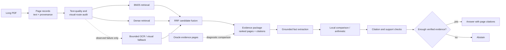

# Evidence-Grounded Document Intelligence

[English](README.md) | [简体中文](README.zh-CN.md)

A reproducible research system for answering questions over long PDFs **with page-level evidence and an explicit option to abstain**.

## At a glance

- **273 PDFs / 14,014 pages** validated, checksummed, and split by document.
- **239 answerable development questions** used for retrieval evaluation.
- **77.41% Complete Evidence Recall@10** with BM25 + dense reciprocal-rank fusion, up from
  70.71% for the BM25 baseline.
- **291 deterministic tests** covering data isolation, retrieval, evidence packaging, grounding,
  citations, abstention, cost controls, and failure recovery.
- **Locked test remains untouched**; reported results are development experiments, not inflated
  final-test claims.

The project studies a practical problem: a language model may be capable of answering a question, but only if the system first finds all required evidence and preserves tables, charts, and page provenance. The core pipeline is therefore:

```text
PDFs
  -> text / OCR / visual representation
  -> BM25 + dense retrieval
  -> reciprocal-rank fusion (RRF)
  -> grounded fact extraction
  -> deterministic comparison
  -> citation verification
  -> answer or abstain
```

## Why this project exists

Ordinary document QA often reports only whether the final answer looks correct. This project separates three questions:

1. **Evidence retrieval:** did the system find every page required to answer?
2. **Grounded reasoning:** can it answer using only the supplied evidence and cite the supporting pages?
3. **Reliability:** does it refuse when the supplied evidence is incomplete?

The primary benchmark is [DocScope](https://huggingface.co/datasets/MiliLab/DocScope), pinned to an immutable revision. Its source PDFs are not redistributed by this repository.

## System architecture



The Oracle Evidence branch is an experiment, not a production shortcut. It supplies benchmark
evidence pages to the same reasoning component so retrieval failures can be separated from
reasoning failures.

## Current results

All numbers below are from the document-isolated `development_tune` split or explicitly described diagnostic pilots. The locked test split has not been used for method development.

### Evidence retrieval — 239 answerable questions

| Method | Any evidence @10 | Complete evidence @10 | MRR | nDCG @10 |
|---|---:|---:|---:|---:|
| Page BM25 | 89.54% | 70.71% | 0.6119 | 0.6258 |
| Dense, BGE-small 256/0 | 93.72% | 74.06% | **0.6810** | 0.6799 |
| **BM25 + Dense RRF** | **94.56%** | **77.41%** | 0.6791 | **0.6911** |

RRF improved complete-evidence recall by 6.69 percentage points over BM25. Seventeen of its eighteen unique gains over dense retrieval were multi-page questions, matching the observed failure mode that finding one relevant page is easier than assembling the full evidence chain.

### Reliability pilot — 24 questions, 72 audited conditions

| Evidence supplied to the same reasoner | Task accuracy | Strict grounded accuracy | Unanswerable false-answer rate |
|---|---:|---:|---:|
| C0: no document evidence | 25.0% | 25.0% | 0.0% |
| C1: BM25 Top-3 pages | 45.8% | 33.3% | 50.0% |
| C2: benchmark evidence pages | **83.3%** | **70.8%** | **0.0%** |

The 37.5-point C1-to-C2 accuracy gap identifies evidence retrieval and representation as major bottlenecks. C0's score comes from always abstaining; it is a safety control, not useful QA performance.

### Failure-driven visual recovery

A bounded page-image fallback recovered **3/3 eligible text-only failures** in a small diagnostic pilot: an unreadable chart, two missing-text pages, and a visually structured list. A global document-count case was deliberately excluded because six selected pages could not prove absence across a 42-page document.

A later tune-only experiment attempted to prioritize RRF candidates using generic table/image/vector
signals across 63 visual questions. Complete Evidence Recall@3 and @5 did not improve, so the
reranker was dropped under its preregistered rule. This negative result defines the remaining V2
problem as question-conditioned visual localization rather than generic page-visual detection.

### Frozen generic comparison validation

The reusable comparison path was frozen before evaluation on six new development documents:

```text
RRF Top-10 -> two grounded facts -> local arithmetic -> citation check -> answer/abstain
```

| Metric | Result |
|---|---:|
| Exact answer match | 4/6 (66.7%) |
| Complete benchmark evidence | 5/6 (83.3%) |
| Coverage | 5/6 (83.3%) |
| Accuracy among answered cases | 4/5 (80.0%) |
| Answered cases with locally verified numeric citations | 5/5 (100%) |
| Paid API cost | $0.078233 |

The two retained failures are informative: one question abstained because retrieval omitted a required address page; one answer used the correct chart pages but attached a value to the wrong flattened chart label.

## Offline demo

The demo replays the frozen six-case validation in readable form. It makes **no API request, creates no new model output, and costs nothing**.

```bash
PYTHONPATH=src python -m egdi.portfolio_demo
```

Inspect one successful, abstained, or failed example:

```bash
PYTHONPATH=src python -m egdi.portfolio_demo --case validation_02
PYTHONPATH=src python -m egdi.portfolio_demo --case validation_01
PYTHONPATH=src python -m egdi.portfolio_demo --case validation_05
```

## Reproduce locally

Python 3.11 or newer is required.

```bash
python -m venv .venv
source .venv/bin/activate
python -m pip install -e .
PYTHONPATH=src python -m unittest discover -s tests -v
```

The full benchmark audit can then be reproduced with:

```bash
PYTHONPATH=src python -m egdi.day1 all --workers 4
```

Paid reasoning experiments require an `OPENAI_API_KEY`, an explicit execution flag, and a cost acknowledgement. Local evaluation, scoring, retrieval, and the portfolio demo do not require a key. Raw PDFs, generated results, model caches, virtual environments, and secrets are excluded from Git.

## Reproducibility and leakage controls

- 273 PDFs and 14,014 pages were validated and checksummed.
- Splits are isolated by document, not by question.
- Method development uses `development_tune`; threshold selection is reserved for `development_calibration`.
- The locked test loader requires an explicit acknowledgement and is not used by ordinary experiments.
- Predictions are frozen before benchmark answers and evidence pages are used for post-hoc scoring.
- Configurations, prompts, inputs, outputs, pricing snapshots, and requests carry SHA-256 identities.
- API runners perform a conservative cost preflight and preserve failed-attempt metadata.

## Repository map

```text
configs/       Frozen experiment and model-call configurations
data/          Non-content manifests and a synthetic schema fixture
experiments/   Immutable selections, reports, scores, and failure analyses
src/egdi/      Retrieval, evidence packaging, reasoning, reliability, and evaluation code
tests/         Deterministic unit and integration tests
```

Start with these records:

- [`PORTFOLIO_STATUS.md`](PORTFOLIO_STATUS.md) — completed work, remaining release tasks, stop line, and resume bullets.
- [`FINAL_EVALUATION_GATE.md`](FINAL_EVALUATION_GATE.md) — why calibration and locked test remain closed, and the one condition for opening them.
- [`experiments/README.md`](experiments/README.md) — short navigation path through the retained experiment history.
- [`DATASET_NOTICE.md`](DATASET_NOTICE.md) — benchmark licensing and redistribution boundary.
- [`PROJECT_PROPOSAL.md`](PROJECT_PROPOSAL.md) — research questions, scope, and completion criteria.
- [`DATA_AND_EVAL_PROTOCOL.md`](DATA_AND_EVAL_PROTOCOL.md) — split, leakage, metric, and cost rules.
- [`DAY1_REPORT.md`](DAY1_REPORT.md) — dataset and text-layer acceptance record.
- [`experiments/day2_bm25_tune_baseline_report.md`](experiments/day2_bm25_tune_baseline_report.md) — sparse baseline.
- [`experiments/day6_hybrid_rrf_tune_report_v0.md`](experiments/day6_hybrid_rrf_tune_report_v0.md) — hybrid retrieval intervention.
- [`experiments/day4_reliability_pilot_report_v0.md`](experiments/day4_reliability_pilot_report_v0.md) — C0/C1/C2 reliability study.
- [`experiments/day5_visual_recovery_report_v0.md`](experiments/day5_visual_recovery_report_v0.md) — visual fallback diagnosis.
- [`experiments/day6_generic_comparison_validation_v0/REPORT.md`](experiments/day6_generic_comparison_validation_v0/REPORT.md) — frozen generic comparison validation.

## Honest project boundary

This is a portfolio research MVP, not a production document platform. It does not claim that retrieval is solved, that six-case comparison validation estimates population performance, or that visual processing should be used on every page. Its contribution is a measured, failure-driven pipeline that makes retrieval gaps, grounding errors, abstentions, cost, and provenance observable instead of hiding them behind a single answer score.

## License

Original project code is available under the [MIT License](LICENSE). Benchmark annotations,
source PDFs, model outputs, and other third-party artifacts retain their respective terms; see
the [dataset and artifact notice](DATASET_NOTICE.md).
