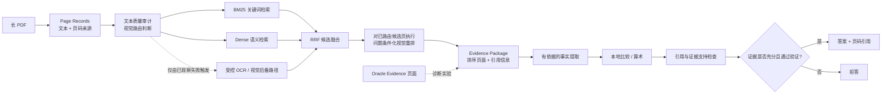

# Evidence-Grounded Document Intelligence

[English](README.md) | [简体中文](README.zh-CN.md)

一个面向长 PDF 问答的可复现实验系统：不仅生成答案，还必须提供**页级证据**；证据不足时，系统会明确拒答。

## 项目概览

- 完成 **273 份 PDF、14,014 页**的有效性验证、校验和固定与文档级数据划分。
- 使用 **239 个可回答的开发集问题**评估证据检索。
- BM25 与 Dense Retrieval 经 RRF 融合后，**Complete Evidence Recall@10 达到 77.41%**，相比 BM25 基线的 70.71% 提升 6.69 个百分点。
- 在 63 道视觉题上加入问题条件化视觉重排后，**Complete Evidence Recall@3 从 55.56% 提升到 66.67%**。
- 包含 **377 个确定性测试**，覆盖数据隔离、检索、证据封装、推理、引用、拒答、成本控制与失败恢复。
- 已在文档隔离的 **132 题 calibration split** 上完成校准；最终回答/拒答规则和包含
  68 个组件的系统清单均在测试集访问前冻结。
- 已完成一次性 locked test：覆盖 **156 份未见文档、730 道题**；系统覆盖率为
  **59.73%**，已回答题任务准确率为 **65.14%**，已回答题严格 Grounded Accuracy 为
  **60.55%**。

## 开发阶段

历史文件名中的 `day1`、`day6` 等仅代表早期实验批次，不是项目开发天数。为保持文件引用、校验和与复现命令有效，这些名称不再修改；项目说明按系统能力组织：

1. **数据基础**：固定数据来源、验证 PDF、按文档划分数据并审计文本层。
2. **证据检索基线**：实现确定性页级评分与 BM25。
3. **有依据推理与可靠性**：比较真实检索与 Oracle Evidence，完成 C0/C1/C2 评测。
4. **OCR 与视觉恢复**：由实际失败触发缺失文字层和布局恢复方案。
5. **Dense 与混合检索**：BGE 向量、互补性分析与 RRF 融合。
6. **通用比较链路**：抽取带引用事实、执行本地计算并支持拒答。
7. **问题条件化视觉检索**：对完整视觉切片执行盲重排，并按预注册门槛决定保留或放弃。
8. **校准、最终冻结与锁定评测**：独立裁判、人工一致性审计、确定性选择性回答、费用
   分批控制，以及带 bootstrap 不确定性的一次性 locked test。

## 为什么做这个项目

普通文档问答通常只关心最终答案是否正确，但一个长文档系统可能在多个环节失败：

1. **Evidence Retrieval（证据检索）**：有没有找到回答问题所需的全部页面？
2. **Grounded Reasoning（有依据推理）**：模型能否只根据给定证据作答，并引用正确页面？
3. **Reliability（可靠性）**：证据不完整时，系统能否拒绝回答，而不是猜测或编造？

因此，本项目不只计算最终答案准确率，而是把“找证据、用证据推理、判断是否应该回答”拆开评估。

主 benchmark 为 [DocScope](https://huggingface.co/datasets/MiliLab/DocScope)，数据版本固定到不可变 revision。仓库不重新分发原始 PDF。

## 系统架构



这里的 Oracle Evidence 不是生产系统的捷径。它在实验中把 benchmark 标注的正确证据页直接交给同一个推理模块，用来区分：失败究竟来自检索阶段，还是来自后续推理阶段。

## 核心方法如何分工

- **BM25**：根据词语匹配和词频快速检索页面，适合专有名词、数字和问题原词明显出现的情况。
- **Dense Retrieval**：将问题和文本块编码为向量，用语义相似度补充 BM25 难以处理的同义表达。
- **RRF（Reciprocal Rank Fusion）**：融合 BM25 与 Dense 的排名，不直接依赖二者分数处于相同尺度。
- **Evidence Package**：保存候选页顺序、正文和页码来源，给后续推理提供可追踪输入。
- **Grounded Fact Extraction**：先从证据中抽取带引用的结构化事实，再执行比较或计算。
- **Selective Answering**：只有证据充分且引用检查通过时才回答，否则输出拒答状态。

## 主要实验结果

以下开发结果来自文档隔离的开发集；最后一节单独报告冻结 V1 在未见 locked test 上的
一次性最终评测。测试结果不用于修改 V1。

### 1. 证据检索：239 个可回答问题

| 方法 | Any evidence @10 | Complete evidence @10 | MRR | nDCG @10 |
|---|---:|---:|---:|---:|
| Page BM25 | 89.54% | 70.71% | 0.6119 | 0.6258 |
| Dense，BGE-small 256/0 | 93.72% | 74.06% | **0.6810** | 0.6799 |
| **BM25 + Dense RRF** | **94.56%** | **77.41%** | 0.6791 | **0.6911** |

这里最重要的不是只找到“某一页相关内容”，而是找到问题所需的**全部证据页**。RRF 相比 BM25 带来的 18 个独有增益中，有 17 个属于多页问题，说明融合方法主要改善了完整证据链的召回。

### 2. 可靠性实验：24 个问题、72 个审计条件

同一个推理模型分别接收三种输入：

- **C0**：只给问题，不给文档证据，用作无证据安全对照。
- **C1**：给 BM25 检索出的 Top-3 页面，代表真实但可能不完整的证据。
- **C2**：给 benchmark 标注的 Oracle Evidence 页面，用于测量证据正确时的推理上限。

| 给推理模块的证据 | 任务准确率 | 严格 Grounded Accuracy | 不可回答问题的错误作答率 |
|---|---:|---:|---:|
| C0：无文档证据 | 25.0% | 25.0% | 0.0% |
| C1：BM25 Top-3 | 45.8% | 33.3% | 50.0% |
| C2：Oracle Evidence | **83.3%** | **70.8%** | **0.0%** |

C1 与 C2 的任务准确率相差 37.5 个百分点，说明证据检索与表示是主要瓶颈。C0 的得分来自始终拒答，它证明了安全行为，但不代表系统具备实际问答能力。

### 3. 失败驱动的 OCR 与视觉恢复

项目没有默认对所有 PDF 运行昂贵的视觉流程，而是先审计文本层，再由实际失败触发 OCR 或页面图像后备路径。在小规模诊断中，该路径恢复了 **3/3 个符合条件的文本路径失败案例**：不可读图表、缺失文字层页面和视觉结构化列表。

另一个全局计数案例被主动排除：只观察 42 页文档中的 6 页，无法证明其他页面不存在目标对象。

首先，我们在 63 个 R1 视觉问题上测试了通用表格、图片和矢量对象信号能否改进 RRF Top-10 内的页面排序。Complete Evidence Recall@3 和 @5 均没有净提升，因此按预注册规则放弃该候选方案。

随后，在查看评分前冻结了问题条件化视觉检索器：把同一组 RRF Top-10 页面渲染为图片，使用固定版本的现成 ColSmol-256M 编码器和 late interaction 重排，不做 DocScope 专项训练，也不添加题号规则。在完整 63 题 R1 tune 切片上，Complete Evidence Recall **Top-3 从 35/63 提升到 42/63**，**Top-5 从 44/63 提升到 50/63**。所有预注册准入条件均通过，因此该重排器进入校准与冻结后的最终系统。这组数字仍是开发集结果；完整 held-out 表现见下文单独报告。

### 4. 可靠性校准：132 道题、35 份未参与开发的文档

冻结后的 V1 流水线在文档隔离的 calibration split 上完整运行一次。预测生成后，系统再独立判断答案语义是否正确、引用证据是否支持答案，并抽取 50 个案例进行人工审计：任务正确性标签达到 50/50 一致；在人可以独立判断的 37 个证据支持案例中，34 个与自动裁判一致。

最终规则允许回答 74/132 道题，覆盖率为 **56.06%**；这些已回答题的任务准确率为 **87.84%**，严格 Grounded Accuracy 为 **79.73%**。预注册的 60% 覆盖率目标实际不可达到，因为资格硬门槛本身最多只允许回答 56.06%。因此修正后的阈值保留全部合格答案，不把 confidence 分数包装成已经校准的概率，也不凭它额外拒答。

### 5. 一次性 locked test：730 道题、156 份未见文档

完整冻结的 V1 系统只在 locked test 上评测一次。730 条预测和所需的 849 条语义/证据
裁判结果全部纳入评分；6 次保留的 API 失败和 1 条无效结构化预测均按任务失败保守计分。

| 指标 | 结果 |
|---|---:|
| Coverage | 436/730（59.73%） |
| 全部问题的任务准确率 | 311/730（42.60%） |
| 全部问题的严格 Grounded Accuracy | 291/730（39.86%） |
| 已回答问题的任务准确率 | 284/436（65.14%） |
| 已回答问题的严格 Grounded Accuracy | 264/436（60.55%） |
| 已回答问题的引用证据支持率 | 374/436（85.78%） |
| 最终引用页 Complete Evidence Recall | 38.05% |

按 156 份文档聚类 bootstrap 后，总体任务准确率的 95% 区间为 **38.29%–46.78%**，
已回答题任务准确率区间为 **60.14%–69.96%**。校准集已回答题准确率为 87.84%，而
locked test 为 65.14%，说明存在真实的泛化差距；该结果不会用于反向调整 V1。完整分析
见[最终 locked-test 报告](experiments/V1_LOCKED_TEST_REPORT.md)。

### 6. 冻结后的通用比较验证

可复用的比较链路在测试前冻结：

```text
RRF Top-10 -> 提取两个带引用事实 -> 本地计算 -> 引用检查 -> 回答或拒答
```

随后在 6 份新的开发文档上运行：

| 指标 | 结果 |
|---|---:|
| 精确答案匹配 | 4/6（66.7%） |
| 完整 benchmark 证据匹配 | 5/6（83.3%） |
| Coverage | 5/6（83.3%） |
| 已回答案例中的准确率 | 4/5（80.0%） |
| 已回答案例中通过本地数值引用验证 | 5/5（100%） |
| 付费 API 成本 | $0.078233 |

两个保留的失败同样具有诊断价值：一个问题因为检索遗漏所需地址页而拒答；另一个问题找到了正确图表页，但扁平化后的图表标签与数值对应错误。

## 零成本离线演示

该演示只重放冻结的六案例验证结果，**不会调用 API，不会生成新的模型输出，也不会产生费用**。

```bash
PYTHONPATH=src python -m egdi.portfolio_demo
```

分别查看成功、拒答和错误案例：

```bash
PYTHONPATH=src python -m egdi.portfolio_demo --case validation_02
PYTHONPATH=src python -m egdi.portfolio_demo --case validation_01
PYTHONPATH=src python -m egdi.portfolio_demo --case validation_05
```

## 本地复现

需要 Python 3.11 或更高版本：

```bash
python -m venv .venv
source .venv/bin/activate
python -m pip install -e .
PYTHONPATH=src python -m unittest discover -s tests -v
```

重新运行完整数据审计：

```bash
PYTHONPATH=src python -m egdi.day1 all --workers 4
```

付费推理实验需要配置 `OPENAI_API_KEY`、显式执行参数和费用确认。本地检索、评分、评测和离线演示均不需要 API key。

## 可复现性与防泄漏设计

- 273 份 PDF 和 14,014 页均经过验证并记录校验和。
- 按文档划分数据，而不是把同一份 PDF 的问题分散到不同 split。
- 方法开发只使用 `development_tune`；文档隔离的 `development_calibration` 只运行一次，
  用于独立评价与阈值选择，没有用于修改检索或推理方法。
- Locked test 默认锁定，普通实验无法意外读取。
- 排名和预测冻结后，才读取 benchmark 答案与证据页进行事后评分。
- 配置、prompt、输入、输出、价格快照和请求均记录 SHA-256 身份。
- API 执行器会在请求前进行保守成本预估，并保存失败尝试的元数据。

## 仓库结构

```text
configs/       冻结的实验与模型调用配置
data/          不包含原文内容的 manifest，以及合成 schema fixture
experiments/   实验选择、报告、评分与失败分析记录
src/egdi/      检索、证据封装、推理、可靠性与评测代码
tests/         确定性单元测试与集成测试
```

建议从以下文件开始阅读：

- [作品集状态与停止线](PORTFOLIO_STATUS.md)
- [最终评测准入条件](FINAL_EVALUATION_GATE.md)
- [实验索引](experiments/README.md)
- [数据集和第三方内容说明](DATASET_NOTICE.md)
- [项目提案](PROJECT_PROPOSAL.md)
- [数据与评测协议](DATA_AND_EVAL_PROTOCOL.md)
- [数据验收报告（历史批次编号为 Day 1）](DAY1_REPORT.md)
- [问题条件化视觉检索实验报告](experiments/visual_retrieval_v1/REPORT.md)
- [V1 最终 locked-test 报告](experiments/V1_LOCKED_TEST_REPORT.md)

## 局限性

1. **视觉检索仍停留在页级，而不是区域级 grounding。** 问题条件化视觉重排在 63 题 R1 tune 切片上取得提升，但它仍对整页评分，不能证明具体哪个表格单元格、图表标记或图像区域支持答案；虽然净结果为正，Complete@3 仍有 4 道题发生回退。
2. **多页证据仍可能召回不完整。** 开发集 RRF Complete Evidence Recall@10 为 77.41%，而 locked test 中只有 38.05% 的合格可回答问题在最终引用里覆盖全部 gold pages。二者衡量的阶段不同，但共同说明候选检索和后续证据收窄都会丢失信息。
3. **OCR 和扁平化布局文本可能丢失结构关系。** 扫描、旋转、表格和图表页面可能保留文字，却丢失行列关系或标签与数值的对应关系。冻结验证中的一个失败案例虽然检索到了正确图表页，但把数值关联到了错误的扁平化标签。
4. **校准表现未能完全泛化。** Locked-test 已回答题任务准确率为 65.14%，比 calibration 低 22.70 个百分点；冻结的 R3 文档全局路线对 33 道题全部拒答。因此 V1 是经过严谨评测的研究原型，而不是生产级系统。

## 后续方向

V1 及其 locked-test 结果现已完成并保持不可变。后续 V2 可以在开发数据上改进区域级 grounding、多页证据保留、文档全局推理和 confidence 校准，并使用新的未见测试集评估。针对单题添加规则、对所有文档无约束运行视觉模型，以及依据这次 locked test 调整权重，仍然不属于这一方向。

## 项目边界

这是一个研究型作品集 MVP，不是生产级文档平台。项目不声称已经解决全部检索问题，也不把六案例验证当作总体性能估计，更不主张所有页面都应该经过视觉模型。

它的核心贡献是建立了一条可测量、可追踪、由失败驱动的文档智能链路：让检索缺口、证据表示问题、推理错误、引用错误、拒答行为、成本和数据来源都可以被单独观察，而不是隐藏在一个最终答案分数中。

## License

项目原创代码采用 [MIT License](LICENSE)。Benchmark 标注、原始 PDF、模型输出及其他第三方内容仍遵循各自条款，详情参见[数据集和第三方内容说明](DATASET_NOTICE.md)。
